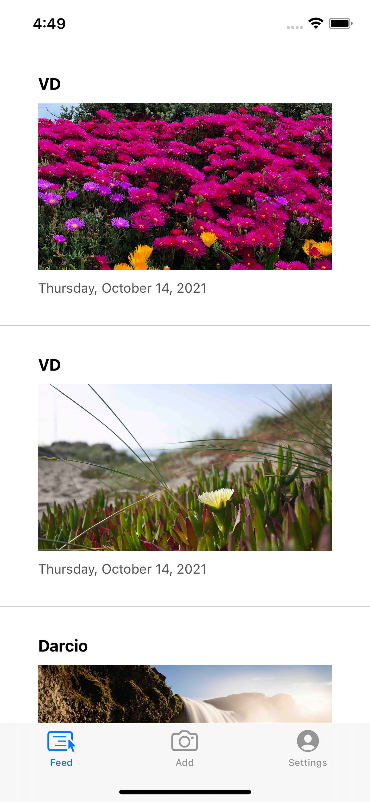

# PhotosApp

  
   

# Description

Photos App simulates a Social media focused on posting photos, using FireBase Storage to store the photos the user uploads
I used the FireBaseUi to auto generate a Login Screen

# Tools Used
### -  Swift  (Programming Language used on the entire Project)

### - FireBase. (Implement Authentication in the app so users can sign up and login, and use FireBase FireStore Database)
### - CocoaPods. (ProgressHUD, KingFisher, IQKeyboardManager and FireBase)
